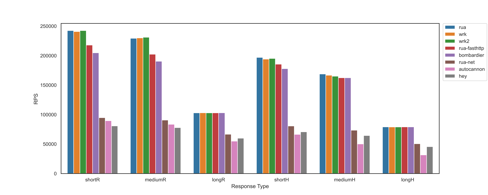

# Rua

Rua, written in Go, is the one of the **fastest** http load generator (see [Benchmark](##benchmark)). Entirely inspired by [wrk](https://github.com/wg/wrk), rua can generate load almost as fast as [wrk](https://github.com/wg/wrk).

Rua is also intended to be one of the best load generator frameworks. You can design your own load configuration and start the load generation programmatically with only a few lines of code.

Rua by default supports its own optimized http implementation, as well as `net/http` , `valyala/fasthttp` client out of the box. It also has pluggable interface so that you can replace and configure your own http client as needed.

## Benchmark

Rua has been benchmarked along with some of the most performant load generators with 6 different response types (short, medium and long response body & headers). In most situations it's as fast as `wrk` and `wrk2`, which are written in C and considered to be the fastest for many years.

See [Benchmark Details](benchmark)



## Install

### Get from go

```shell
go get -u github.com/taoxinyi/rua
```

`rua` will inside `$GOPATH/bin`

### Build from source

```shell
git clone github.com/taoxinyi/rua
cd rua
go build
```

## Basic Usage

The following command runs a benchmark for 5 seconds, using 2 threads, and using 10 connections(goroutines).

```shell
$ rua -t 2 -c 10 -d 5s http://example.com
Running 5s test @ http://example.com
 2 threads and 10 connections
------------------------------------------------------------------------
            Connection  Timeout     Status       
Errors      0           0           0           
------------------------------------------------------------------------
            Avg         Min         Max         tdev        +/- Stdev    
Latency     12.010ms    10.915ms    31.974ms    1.210ms     95.347%     
------------------------------------------------------------------------
            50%         75%         90%         99%         99.9%        
Latency     11.999ms    12.021ms    13.000ms    18.003ms    22.030ms    
------------------------------------------------------------------------
            Count       Count/s     Size        Throughput   
Requests    4169        831.29      151 KiB     30 KiB/s    
Responses   4169        831.29      6.3 MiB     1.3 MiB/s   

4169 responses received in 5.0151051s, 6.3 MiB read
```

## Command Line Options

```
Usage: rua <options> url
Options:
  -d, --duration duration       Duration of test (default 10s)
  -c, --connections int         Number of connections (default 10)
  -t, --threads int             Number of OS threads to be used (default 8)
  -H, --header string           HTTP header to add to the request (default "map[]")
  -T, --timeout duration        Timeout in seconds (default 1s)
  -M, --max-response-size int   Max response size in order to allocate buffer (default 4096)
  -m, --method string           The HTTP method to be used (default "GET")
  -b, --body string             HTTP body to add to the request
  -C, --client string           Use the underlying HTTP client using one of [raw fasthttp net] (default "raw")
  -V, --verbose                 Whether print verbose information
```

## Framework Usage
The following code runs a benchmark for 5 seconds, using 2 threads, and using 10 connections(goroutines).
```go
package main

import (
	"fmt"
	rua "github.com/taoxinyi/rua/framework"
	"github.com/taoxinyi/rua/framework/client"
	"os"
	"time"
)
func main() {
	config := &rua.LgConfig{
		RequestConfig: rua.RequestConfig{URL: "http://example.com"},
		Duration:      5 * time.Second,
		Connections:   10,
	}
	lg, err := rua.NewLoadGenerator(config, client.NewRawHttpClient())
	if err != nil {
		fmt.Println(err)
		os.Exit(-1)
	}
	stats, actualRunningTime := lg.Start()
	fmt.Printf("RPS: %.3f\n", float64(stats.ResponsesRecv)/actualRunningTime.Seconds())
}

```

## Implement Your Own Http Client

`HttpClient` and `User` interface can be implemented so that the framework can use your `HttpClient` for your workloads. e.g. HTTP/2, Redirect, customized configurations, etc.

See [Client](framework/client)

## How to build an optimized Http Client for Load Generation
1. Each goroutine has a dedicated a TCP connection, there's no need to do any synchronization on them at all.

2. In most scenarios, it's not the load generator's job to test the correctness of the response. There is no need to parse the headers and copy the body. We only need the status code, content length so that we know whether the response is complete or not.

3. If the request will not change, then it's immutable. There is no need to build them or convert them to bytes every time. Directly send the request bytes.

4. Zero memory allocation during the load generation, avoid copy as much as possible

## Limitations

Rua's optimized raw client is implemented in the following ways:

Read until reaches the first `\r\n\r\n`, then find `Content-Length` in the header. Then read until the body size equals `Content-Length`

However, if you have extremely long headers, the recv buffer is full, and `\r\n\r\n` hasn't reached yet, an error will be thrown. So you should increase the `-M, --max-response-size` size instead So the size can at least large enough for the first `\r\n\r\n`

`Content-Length` must be present in the response, otherwise an error will be thrown since the parser doesn't know the body size. Therefore, `Connection: close` is not supported, only `keep-alive` is supported. Also, `Chunk` is not supported since it only knows the body size. Use `--client fasthttp` instead if you need `Connection: close` or `Chunk`.

In summary, use `--client fasthttp` for reliable, use the default `raw` if you need extreme performance and your responses doesn't have any corner cases.

## Future Improvements

Rua is still in early stage and there are a lot of features to come. I wonder if it's the already reach the limit of Go in terms of speed and performance. 

If you have any ideas to improve rua, welcome to submit a PR

## Acknowledgements

This project is entirely inspired by [wrk](https://github.com/wg/wrk), also thanks to other great projects like [wrk2](https://github.com/giltene/wrk2), [go-wrk](https://github.com/tsliwowicz/go-wrk), [fasthttp](https://github.com/valyala/fasthttp)