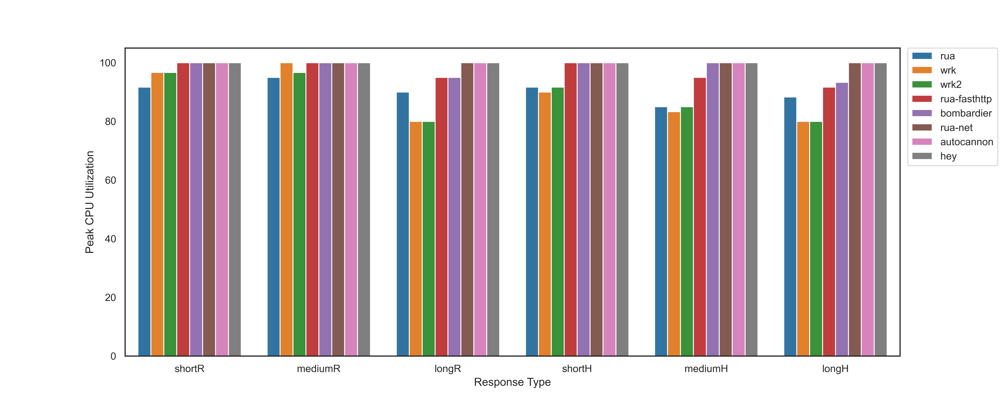
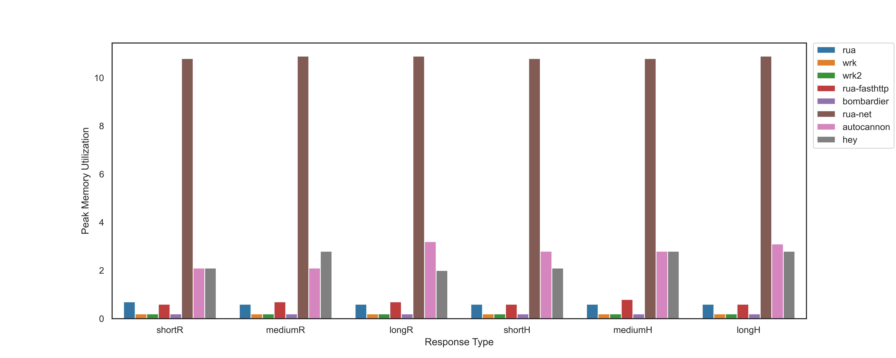

# Rua Benchmark

## Hardware

2 VMs with AWS c5.xlarge (4vCPU, 8GiB memory), in the same region and subnet

One for hosting the web server using `fasthttp`
It has 6 routes, 
```
/shortR     default headers + short response 
/mediumR    default headers + medium response 
/longR      default headers + long response
/shortH     10 short headers + medium response
/mediumH    10 short headers + 10 medium headers + medium response
/longH      10 short headers + 10 medium headers + 2 long headers + long response
```
```go
package main

import (
	"bytes"
	"fmt"
	"github.com/fasthttp/router"
	"github.com/valyala/fasthttp"
	"strconv"
)

var shortBody = []byte("Hello World!")
var mediumBody = bytes.Repeat(shortBody, 100)
var longBody = bytes.Repeat(mediumBody, 10)

var shortHeader = []byte("ShortHeader")
var mediumHeader = bytes.Repeat(shortHeader, 10)
var longHeader = bytes.Repeat(mediumHeader, 10)

func shortRHandler(ctx *fasthttp.RequestCtx) {
	ctx.Response.SetBody(shortBody)
}
func mediumRHandler(ctx *fasthttp.RequestCtx) {
	ctx.Response.SetBody(mediumBody)
}
func longRHandler(ctx *fasthttp.RequestCtx) {
	ctx.Response.SetBody(longBody)
}
func shortHHandler(ctx *fasthttp.RequestCtx) {
	addHeaders(&ctx.Response.Header, "short", shortHeader, 10)
	ctx.Response.SetBody(mediumBody)
}
func mediumHHandler(ctx *fasthttp.RequestCtx) {
	addHeaders(&ctx.Response.Header, "short", shortHeader, 10)
	addHeaders(&ctx.Response.Header, "medium", mediumHeader, 10)
	ctx.Response.SetBody(mediumBody)
}
func longHHandler(ctx *fasthttp.RequestCtx) {
	addHeaders(&ctx.Response.Header, "short", shortHeader, 10)
	addHeaders(&ctx.Response.Header, "medium", mediumHeader, 10)
	addHeaders(&ctx.Response.Header, "long", longHeader, 2)
	ctx.Response.SetBody(longBody)
}
func addHeaders(header *fasthttp.ResponseHeader, key string, value []byte, count int) {
	for i := 0; i < count; i++ {
		header.SetBytesV(key+strconv.Itoa(i), value)
	}
}
// uncomment to run
func main() {
	r := router.New()
	r.ANY("/shortR", shortRHandler)
	r.ANY("/mediumR", mediumRHandler)
	r.ANY("/longR", longRHandler)
	r.ANY("/shortH", shortHHandler)
	r.ANY("/mediumH", mediumHHandler)
	r.ANY("/longH", longHHandler)
	err := fasthttp.ListenAndServe(":80", r.Handler)
	if err != nil {
		fmt.Println(err)
	}
}
package main

import (
"bytes"
"fmt"
"github.com/fasthttp/router"
"github.com/valyala/fasthttp"
"strconv"
)

var shortBody = []byte("Hello World!")
var mediumBody = bytes.Repeat(shortBody, 100)
var longBody = bytes.Repeat(mediumBody, 10)

var shortHeader = []byte("ShortHeader")
var mediumHeader = bytes.Repeat(shortHeader, 10)
var longHeader = bytes.Repeat(mediumHeader, 10)

func shortRHandler(ctx *fasthttp.RequestCtx) {
	ctx.Response.SetBody(shortBody)
}
func mediumRHandler(ctx *fasthttp.RequestCtx) {
	ctx.Response.SetBody(mediumBody)
}
func longRHandler(ctx *fasthttp.RequestCtx) {
	ctx.Response.SetBody(longBody)
}
func shortHHandler(ctx *fasthttp.RequestCtx) {
	addHeaders(&ctx.Response.Header, "short", shortHeader, 10)
	ctx.Response.SetBody(mediumBody)
}
func mediumHHandler(ctx *fasthttp.RequestCtx) {
	addHeaders(&ctx.Response.Header, "short", shortHeader, 10)
	addHeaders(&ctx.Response.Header, "medium", mediumHeader, 10)
	ctx.Response.SetBody(mediumBody)
}
func longHHandler(ctx *fasthttp.RequestCtx) {
	addHeaders(&ctx.Response.Header, "short", shortHeader, 10)
	addHeaders(&ctx.Response.Header, "medium", mediumHeader, 10)
	addHeaders(&ctx.Response.Header, "long", longHeader, 2)
	ctx.Response.SetBody(longBody)
}
func addHeaders(header *fasthttp.ResponseHeader, key string, value []byte, count int) {
	for i := 0; i < count; i++ {
		header.SetBytesV(key+strconv.Itoa(i), value)
	}
}
// uncomment to run
func main() {
	r := router.New()
	r.ANY("/shortR", shortRHandler)
	r.ANY("/mediumR", mediumRHandler)
	r.ANY("/longR", longRHandler)
	r.ANY("/shortH", shortHHandler)
	r.ANY("/mediumH", mediumHHandler)
	r.ANY("/longH", longHHandler)
	err := fasthttp.ListenAndServe(":80", r.Handler)
	if err != nil {
		fmt.Println(err)
	}
}
```


One for generate load to the server using `rua`, `rua` with `fasthttp` client, `autocannon`, `bombardier`, `hey`, `wrk` and `wrk2`

## Configuration
For the load generators, uses 100 connections, 4 threads, 30s

## Result
Rua has only ~2% lower RPS compared to `wrk` when the response is relatively small and lower CPU utilization in most scenarios.
The CPU on the load generator is not saturated while the CPU on the server is.
Overall, it's already quite impressive to send 230,000+ requests per second on a 4 core machine.


